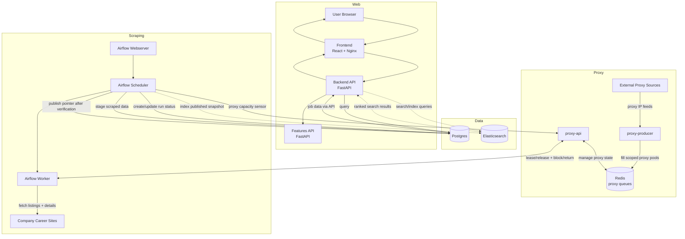

# JobSearch

JobSearch is a job discovery platform focused on two outcomes:
- fresher job data than aggregator-style feeds
- better match quality by ranking jobs against a candidate profile/resume

This repo contains the scraping pipeline, feature service, and web stack that power that product.

## Background
Most job seekers rely on broad aggregators that can lag behind company career sites and provide generic ranking. That creates three recurring problems:
- stale listings (roles already closed or changed)
- weak ranking relevance for a specific candidate
- inconsistent detail quality across sources

JobSearch is designed to pull directly from company sources, normalize the data, and expose a stable published snapshot that can be ranked for individual users.

## Purpose
JobSearch exists to deliver:
- **faster updates**: direct company-site scraping with controlled publish cadence
- **better matching**: skill/profile-aware ranking instead of keyword-only retrieval
- **reliable reads**: atomic snapshot publishing so users never see partial runs

## Differentiators
- **Freshness advantage**: direct company-site scraping aims to surface new jobs faster than aggregator lag.
- **Skill-based matching**: recommendation quality is designed around resume/profile-to-job semantic alignment, not only raw keyword overlap.
- **Atomic publishing**: users see only fully validated snapshots.

## Product Goals
- Reduce latency from upstream company site updates to customer-visible results (target: within the hour).
- Improve match precision beyond keyword-only search by using structured fields.
- Keep ingestion resilient under blocking/rate-limit pressure using scoped proxy rotation.
- Maintain reproducible versioned snapshots so every published state is auditable.

## User Workflows (Product)
- **Resume uploaded**: parse resume/profile signals, retrieve candidate jobs, rank by relevance.
- **Search without resume**: keyword/filter discovery on latest published catalog.
- **Browse fallback**: show recent/popular jobs when user has no resume and no query.
- **Job detail view**: fetch full normalized detail for a selected job from the active published snapshot.
- **Location filtering**: browse/search by `country`, `region`, and `city` using Elasticsearch-derived filter values.

## Repository Layout
- `src/scrapers/`: Airflow DAG, scraper clients, proxy subsystem.
- `src/features/`: FastAPI feature service for skills, embeddings, and location normalization.
- `src/web/`: FastAPI backend + React frontend.
- `src/sql/`: DB schema and initialization scripts.
- `tst/`: unit tests.
- `integration/`: integration tests.

## Architecture (High Level)


1. **Proxy layer**: `proxy-producer` continuously fills per-scope proxy queues; `proxy-api` leases/releases/blocks IPs.
2. **Scraper layer**: Airflow runs scheduled company scrapers that lease proxies, normalize locations through the features service, and accumulate `jobs` + `job_details` into a new run version.
3. **Publish gate**: data is not marked published while the run is in progress; publish happens only after consistency checks succeed.
4. **Feature layer**: shared extraction endpoints provide job skills, query embeddings, and location normalization.
5. **Web layer**: backend reads only the published snapshot pointer (`jobs_catalog`), queries Elasticsearch for search/filter UX, and exposes that stable snapshot to frontend/customers.

## Current vs Target
- `Current in repo`: versioned DB snapshot pipeline (`publish_runs` + `publication_pointers`), proxy rotation, web API + UI.
- `Target from design doc`: hourly freshness SLA as default production cadence, AI tagging/enrichment, embedding-based retrieval (KNN), and learning-to-rank personalization.

## Atomic Customer Updates
- Each scrape writes into a new run/version (`publish_runs.run_id` + `version_ts`) instead of mutating the currently published snapshot.
- Customers read through `publication_pointers` (`namespace='jobs_catalog'`), not by directly picking an in-progress run.
- The pointer is updated only after validation succeeds (`publish_db_pointer`), so customers see either the full previous snapshot or the full new snapshot, never partial in-run writes.

## Prerequisites
- Docker + Docker Compose
- Python 3.14+
- Node.js + npm (for frontend tests)

## Python Setup (Optional via pyenv)
If you want a consistent local Python (default `3.14.0`) managed by `pyenv` and a recreated project virtualenv:

```bash
make pyenv-setup-python
```

## Local Development
Start all local services:

```bash
make up
```

Default local service URLs:
- frontend: `http://localhost:5173`
- backend: `http://localhost:8000`
- features API: `http://localhost:8010`

Inspect services/logs:

```bash
make ps
make logs
make logs SERVICE=airflow-scheduler
make logs SERVICE=proxy-producer
```

Stop or teardown:

```bash
make down
make teardown
```

Open Airflow UI:

```bash
make airflow-open
```

## Database Utilities
```bash
make db-list
make db-peek TABLE=publish_runs
make db-peek TABLE=jobs LIMIT=5 TRUNCATE_CHARS=40
make db-count-jobs
make db-failures
```

## Testing
Unit + coverage:

```bash
make test-unit
```

Note: frontend coverage enforces 100% statement coverage via Vitest thresholds.

Integration tests:

```bash
make test-integration
```

Full test suite:

```bash
make test
```

Feature-service smoke test:

```bash
make test-location-normalization ARGS='--location "Seattle, WA, USA" --location "London, UK"'
```

## Key Documentation
- Features service: `src/features/README.md`
- Scrapers overview: `src/scrapers/README.md`
- Airflow pipeline: `src/scrapers/airflow/README.md`
- Airflow clients: `src/scrapers/airflow/clients/README.md`
- Proxy subsystem: `src/scrapers/proxy/README.md`
- SQL schema/init: `src/sql/README.md`
- Web stack: `src/web/README.md`
- Web backend: `src/web/backend/README.md`
- Web frontend: `src/web/frontend/README.md`
