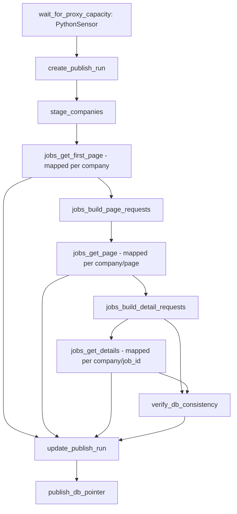

# `job_scrapers_local` DAG Structure

## Overview
- **DAG ID**: job_scrapers_local
- **Schedule**: `0 */4 * * *` (every 4 hours)
- **Purpose**: scrape jobs/details by company, write versioned rows to DB, verify consistency, and atomically move `jobs_catalog` pointer.

## Task Graph

## Step Responsibilities
1. `wait_for_proxy_capacity`
- Polls proxy API `sizes(scope=...)` for all configured scopes.
- Requires:
  - total available >= `JOBSEARCH_AIRFLOW_PROXY_MIN_AVAILABLE_TOTAL`
  - each scope available >= `JOBSEARCH_AIRFLOW_PROXY_MIN_AVAILABLE_PER_SCOPE`

2. `create_publish_run`
- Upserts `publish_runs` for current Airflow `run_id`.
- Sets `status='in_progress'`, clears prior DB/ES readiness fields.

3. `stage_companies`
- Upserts one `companies` row per configured company for this `run_id`.

4. `jobs_get_first_page` (mapped by company)
- Calls `client.get_jobs(page=1)` with proxy retry wrapper.
- Computes `pages_to_fetch` (`meta` forced to 1; others from response up to `JOBSEARCH_AIRFLOW_MAX_PAGES`).

5. `jobs_build_page_requests`
- Builds `{company, page}` request list for mapped page scraping.

6. `jobs_get_page` (mapped by `{company,page}`)
- Fetches page jobs.
- Writes/updates `jobs` rows immediately (incremental write).
- Sets `is_missing_details=FALSE` on successful upsert for seen jobs.

7. `jobs_build_detail_requests`
- Deduplicates IDs and builds `{company, job_id}` list.

8. `jobs_get_details` (mapped by `{company,job_id}`)
- Fetches details with proxy retry wrapper.
- On `404`: marks `jobs.is_missing_details=TRUE` and treats mapped item as handled.
- On success: upserts `job_details`; backfills `jobs.posted_ts` if detail has it.

9. `verify_db_consistency`
- Validates per company:
  - `jobs_count == expected_scraped_ids - missing_details_count`
  - `job_details_count == jobs_count` (excluding `is_missing_details=TRUE` jobs)
  - all included `job_details.job_description` are non-empty
- Fails run on any violation.

10. `update_publish_run`
- Aggregates task-level mapped errors from first-page/page/detail outputs.
- Updates `publish_runs.status` and `db_ready`.
- Raises failure if any scrape errors exist.

11. `publish_db_pointer`
- Only when run status is `succeeded`.
- Upserts `publication_pointers(namespace='jobs_catalog')` to this `run_id`.
- Sets `publish_runs.db_published_at`.

## Failure Behavior
- Proxy/network/upstream errors are retried inside `_call_with_proxy_retry`.
- If `JOBSEARCH_AIRFLOW_FAIL_ON_COMPANY_ERROR=true`, mapped task errors bubble immediately.
- Otherwise mapped tasks return `success=false`; `update_publish_run` later fails whole DAG run.
- True 404 detail misses do **not** fail the run by themselves; they are represented by `jobs.is_missing_details=TRUE` and excluded from detail parity checks.

## Main Tables Touched
- `publish_runs`
- `publication_pointers`
- `companies`
- `jobs`
- `job_details`
